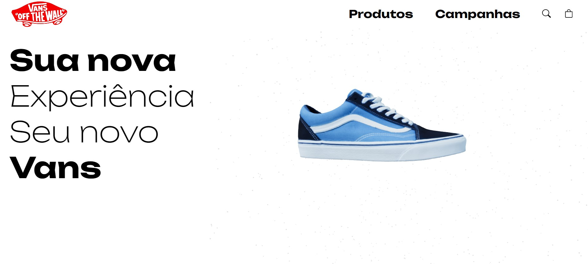

# Vans

A basic Vans website with 3D models using Three.js 

### Developers: 
* [Marcos Vinicius Ferreira](https://github.com/marcosnaofazisso) 

## Goals and Rules:
The main goals of Vans project was to study the usage of 3D Models in webpages and understand concepts like camera position, light, mesh, angles (x, y, z) and the physics of light. 

There are no more complex functionalities and the project its not all sizes resposive.

# Demo
https://user-images.githubusercontent.com/79977399/227586134-736598f0-574a-4037-995d-4bc8e5797b82.mp4

For desktop and mobile.

# Tutorial
Libraries used were: 

- React Icons
- Styled Components
- ThreeJS Fiber
- ThreeJS Drei
- ThreeJS Cannon

Always look for the official documentation: https://threejs.org/docs/

    "@react-three/cannon": "^6.5.2",
    "@react-three/drei": "^9.58.2",
    "@react-three/fiber": "^8.12.0",
    "react-icons": "^4.8.0",
    "styled-components": "^5.3.9",

## Thank you!
